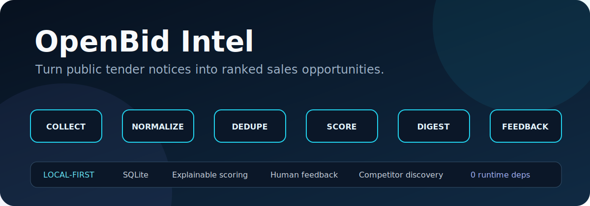
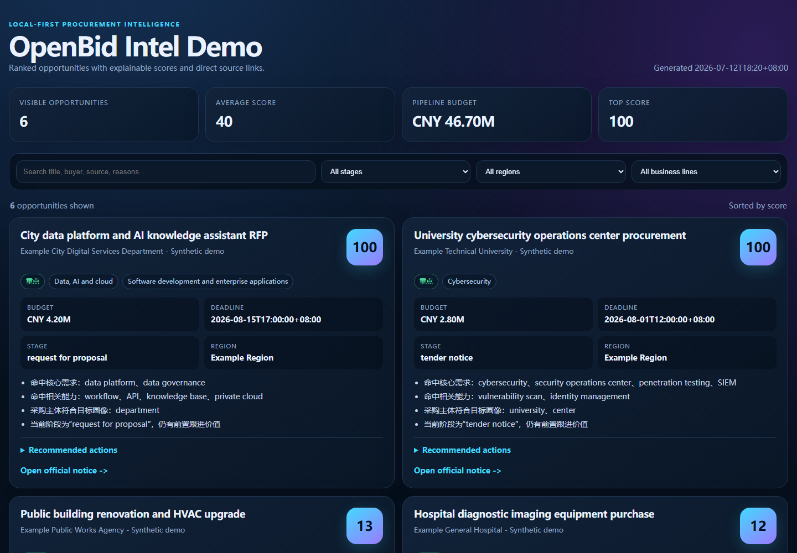

<div align="center">



# OpenBid Intel

**Turn messy tender feeds into ranked opportunities for any industry - locally.**

[](https://github.com/shkyyy18/openbid-intel/actions/workflows/tests.yml)
[](https://www.python.org/)
[](LICENSE)
[](pyproject.toml)

[**Live demo**](https://shkyyy18.github.io/openbid-intel/) | [Quick start](#30-second-quick-start) | [Dashboard](#portable-html-dashboard) | [Industry packs](#built-in-industry-packs) | [Import your data](#import-from-any-export) | [Roadmap](ROADMAP.md)

</div>

Public procurement data is fragmented across portals, spreadsheets, subscriptions, email alerts, and internal exports. Keyword alerts are noisy, while generic summaries do not understand what your team sells.

**OpenBid Intel** is an open-source, local-first toolkit that normalizes tender notices, removes duplicates, ranks opportunities against an editable industry profile, creates an actionable digest, and learns from sales feedback. Start with CSV/JSON exports, choose an industry pack, and add compliant connectors only when you need them.

> OpenBid Intel is a triage and intelligence tool, not a bidding database or legal source of truth. Verify deadlines, amounts, qualifications, and attachments on the official notice page.

**Try it before installing:** the [live dashboard](https://shkyyy18.github.io/openbid-intel/) is rebuilt from synthetic data on every push to `main`; it contains no private or collected procurement data.



## Why this project exists

- **Useful across industries:** the engine is not tied to one company, region, portal, or product category.
- **Fast first result:** six built-in profile packs cover common procurement markets.
- **Bring almost any export:** JSON, JSONL, and CSV imports support common English and Chinese field aliases plus custom mappings.
- **Explainable ranking:** every score includes matched reasons, risks, and recommended next actions.
- **Portable visual dashboard:** generate one self-contained HTML file with search and filters; no server required.
- **Local-first:** notices, profiles, scores, feedback, and reports remain in SQLite unless you explicitly send a digest.
- **Connector-friendly, not scraper-first:** use exports immediately; add low-frequency public-source adapters with offline fixtures.
- **Zero runtime dependencies:** the CLI uses only the Python standard library.

## 30-second quick start

Requires Python 3.11 or newer.

```bash
git clone https://github.com/shkyyy18/openbid-intel.git
cd openbid-intel
python run.py demo
```

The cross-industry demo imports six synthetic notices and ranks the IT, data, AI, and cybersecurity opportunities using the default `it-digital` profile. It writes both `reports/demo_digest.md` and the interactive `reports/demo_dashboard.html`.

Install the CLI locally:

```bash
python -m pip install -e .
openbid init education --source-template rss
openbid --profile config/profile.local.json --sources config/sources.local.json demo
```

Windows users can also run `bid-intel.cmd demo` without changing the PowerShell execution policy.

## Portable HTML dashboard

Generate a polished, self-contained dashboard directly from the local SQLite database:

```bash
openbid dashboard --min-score 50 --output reports/dashboard.html
```

The file works offline and can be opened in any modern browser. It includes full-text search, stage/region/business-line filters, pipeline summary metrics, explainable score reasons, recommended actions, and safe links to official notices. No web server, JavaScript framework, or external asset is required.

## Built-in industry packs

| Profile pack | Typical opportunities |
|---|---|
| `it-digital` | Software, cloud, AI, data platforms, cybersecurity |
| `medical-lab` | Medical devices, diagnostics, lab and scientific instruments |
| `construction` | Buildings, renovation, civil works, HVAC and MEP |
| `marketing-services` | Branding, events, research, consulting and training |
| `energy-sustainability` | Solar, storage, efficiency, carbon and environmental services |
| `education` | Digital learning, teaching/lab equipment, campus services and infrastructure |

Create both ignored local configuration files in one step, or list and initialize only a profile pack:

```bash
openbid init education --source-template rss
openbid profiles
openbid init-profile energy-sustainability --output config/profile.local.json
```

`openbid init` validates both generated files, refuses to overwrite them unless `--force` is supplied, and prints the exact import and dashboard commands to run next. In a terminal it offers profile selection; in scripts and redirected sessions it safely defaults to `it-digital`. The optional RSS template is disabled until you replace its placeholder URL and explicitly enable it.

A profile pack is ordinary JSON, not a locked model. Fork it for a niche market, change product terms, add account aliases, set budget thresholds, or contribute a sanitized pack for a broadly useful sector. See [Profile pack authoring](docs/PROFILE_PACKS.md) for the public-pack contract and review checklist.

## Validate configuration

Profile and source files are documented with JSON Schema 2020-12 under `schemas/`. The public files include relative `$schema` hints, while `openbid init-profile` writes a stable hosted schema URL so editors such as VS Code can provide completion and inline errors. Validate both active files without installing a third-party package:

```bash
openbid validate-config
openbid --profile config/profile.local.json validate-config --only profile
```

Validation reports exact JSON paths, missing required fields, invalid types and ranges, empty required arrays or strings, and duplicate business-line or source IDs before collection or scoring begins.

## Import from any export

OpenBid Intel accepts a top-level JSON array, JSON objects containing `notices`, `items`, or `results`, JSONL, and CSV. It recognizes common source headers automatically.

```bash
openbid import procurement-export.csv --score
```

For unusual column names, provide a mapping from canonical OpenBid fields to source fields:

```bash
openbid import procurement-export.csv \
  --mapping samples/field_mapping.example.json \
  --score
```

Example mapping:

```json
{
  "title": "Project Name",
  "url": "Notice Link",
  "published_at": "Published Date",
  "budget_cny": "Estimated Value"
}
```

Amount parsing handles values such as `$1.25 million`, `1.2 billion`, `CNY 1.25 million`, and `CNY 200 million`. Canonical fields include `title`, `url`, `source`, `published_at`, `deadline_at`, `stage`, `buyer`, `region`, `budget_cny`, `content`, `award_supplier`, and `award_amount_cny`.

## What you get

| Capability | Command | Output |
|---|---|---|
| Discover profile packs | `openbid profiles` | Available industries and descriptions |
| Create an editable profile | `openbid init-profile it-digital` | Private local JSON configuration |
| Import exports | `openbid import notices.csv --score` | Normalized and deduplicated records |
| Collect configured public pages | `openbid collect --score` | New notices and collection run log |
| Score against your profile | `openbid score --all` | 0-100 scores, reasons, risks, actions |
| Generate an opportunity digest | `openbid digest --min-score 50` | Markdown or terminal report |
| Generate an HTML dashboard | `openbid dashboard --min-score 50` | Interactive, self-contained HTML |
| Export qualified opportunities | `openbid export --min-score 50` | CRM-friendly Excel CSV |
| Run a daily pipeline | `openbid daily --no-push` | Collection, scoring, dated digest |
| Record sales feedback | `openbid feedback 42 VERDICT --note "owner assigned"` | Auditable human decision |
| Analyze award suppliers | `openbid competitors` | Supplier ranking and buyer history |
| Build an intelligence bundle | `openbid intelligence --no-push` | Digest, account, supplier and quality reports |
| Verify an install or release | `openbid release-check` | Fully offline checks |

The CSV export uses UTF-8 with a BOM (`utf-8-sig`) so current Excel versions detect non-ASCII text without an import wizard. It contains only stable notice IDs, opportunity fields, score, matched business lines, URL, and latest verdict. Notice content, raw payloads, webhook secrets, and internal feedback notes are excluded by default.

Feedback verdicts currently use Chinese labels. Run `openbid feedback --help` to see the accepted values.

## How it works

```text
CSV / JSON / JSONL / public connectors
                  |
                  v
       NORMALIZE -> DEDUPE -> SCORE -> DIGEST -> FEEDBACK
                         |       |         |
                         +---- SQLite -----+
                                  |
                                  +-> supplier and buyer relationships
```

Scoring is deterministic and configurable. It combines:

- strong and related product terms;
- procurement-stage weighting;
- buyer-category terms;
- target-account aliases and weights;
- region fit;
- minimum deal threshold;
- negative and noise terms;
- recency and deadline signals.

No source, region, or niche industry receives a hidden hard-coded advantage. Collection detail priority follows the active source configuration; opportunity ranking follows the active profile.

## Customize without exposing private sales data

The public repository contains generic examples. Keep your real sales configuration in ignored local files:

```bash
openbid init it-digital
openbid --profile config/profile.local.json --sources config/sources.local.json import notices.csv --score
openbid --profile config/profile.local.json digest --min-score 50
```

`config/*.local.json`, `.env`, SQLite databases, and generated reports are ignored by Git. Do not commit customer lists, internal pricing, restricted requirements, credentials, or bid strategy.

This separation is intentional:

```text
Open-source core                 Private local deployment
-----------------------------    --------------------------------
normalization and deduplication  customer and account aliases
explainable scoring engine       niche product vocabulary
industry profile packs           territory and budget thresholds
connector interface              internal notes and sales feedback
sanitized fixtures               private sources and credentials
```

## Inputs and connectors

Two connector types are included:

- `ccgp_list`: a conservative adapter for selected public list pages on the China Government Procurement Network;
- `rss_atom`: a generic standard-library RSS 2.0 and Atom feed connector with relative-link handling, history cutoffs, deduplication, and optional item limits.

Copy `samples/sources.rss.example.json` to an ignored local source configuration and replace the synthetic URL with a public feed you are permitted to access. The connector registry in `src/bid_intel/connectors.py` is the stable extension point for community adapters. Each connector receives a shared context for pacing, history limits, detail budgets, and fetching, and returns normalized `Notice` records plus non-fatal warnings.

These adapters are examples, not the product boundary, and OpenBid Intel does **not** claim complete national or global coverage. Public portals change, block automation, and expose incomplete metadata. Add connectors only when ordinary public access and site terms permit it. Never bypass authentication, CAPTCHA, paywalls, or access controls. Prefer official APIs, open-data feeds, RSS, email exports, and manual exports where available.

See [Data Sources](docs/DATA_SOURCES.md) and [Public Data Handling](docs/DATA_HANDLING.md).

## Supplier and buyer intelligence

Award notices can reveal recurring supplier-buyer relationships. OpenBid Intel extracts award suppliers, ranks frequency and value, filters results through the active industry profile, and builds priority-account reports.

These are leads for verification, not verified competitor classifications. A supplier may be an OEM, reseller, integrator, service provider, or unrelated vendor with a similar name.

## Optional Feishu notifications

Copy `.env.example` to `.env`, then add a Feishu group-bot webhook and optional signing secret:

```text
FEISHU_WEBHOOK_URL=
FEISHU_WEBHOOK_SECRET=
```

Run `openbid doctor`, then remove `--no-push` from daily or intelligence commands. Secrets are never required for local reports.

## Scheduling on Windows

```powershell
powershell -NoProfile -ExecutionPolicy Bypass -File .\scripts\install_task.ps1 -At 08:30
powershell -NoProfile -ExecutionPolicy Bypass -File .\scripts\install_weekly_task.ps1 -DayOfWeek Sunday -At 09:00
```

See the [Operations Guide](docs/OPERATIONS.md).

## Good first contributions

The easiest ways to extend OpenBid Intel are intentionally modular:

- contribute a sanitized industry profile pack;
- add a fixture-tested importer alias or amount format;
- build a compliant connector for a public procurement source;
- improve profile schema validation;
- improve the portable HTML dashboard or add a CRM-friendly export.

Read [CONTRIBUTING.md](CONTRIBUTING.md), open a Discussion for source-compliance questions, and never submit private customer data or live credentials.

## Project status

OpenBid Intel is an early but usable release. Import, deduplication, scoring, reporting, the portable dashboard, feedback, supplier analysis, and the local workflow are ready for real-world validation. Source coverage remains deliberately small while the project prioritizes trustworthy, reusable foundations over a long list of brittle scrapers.

See [ROADMAP.md](ROADMAP.md).

## License

MIT (c) 2026 shkyyy18
